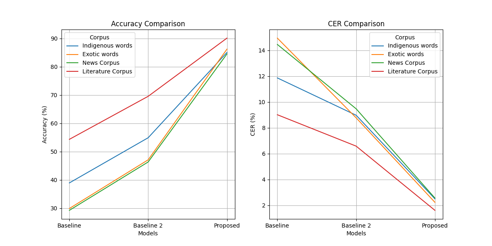

# xlit 🏁

This repository contains the two modules developed for Machine Transliteration from raw data (bengali glyph through s550 font) to Meeteilon (Meetei/Meitei Mayek Unicode). It includes

- `glyph correction` (s-550 → bn_unicode)
- `transliteration` (bn_unicode → mm_unicode)

## 1. Quickstart

1. Clone this repository.

   ```sh
   git clone https://github.com/hoomexsun/xlit.git
   ```

2. Install python requirements. Please refer [requirements.txt](requirements.txt).
3. Enter your file, specify the location and run either `main.py` or
   - run `python run.py`.

For custom usage, follow after step 1 & 2.

### 1.1. Glyph Correction

1. After adding your input file.
2. Extract the string from the file and call either `gc.correct()` or `gc.correct_words()`.

   ```python
   # run.py
   from pathlib import Path
   from src.gc_ import GlyphCorrection

   content = Path("<YOUR_FILE_PATH>").read_text(encoding="utf-8")
   gc = GlyphCorrection()

   output_1 = gc.correct_words(content) # For huge text
   # or
   output_2 = gc.correct(content) # Simpler
   ```

3. Now, run `run.py`.

### 1.2. Machine Transliteration

1. After adding your input file.
2. Extract the string from the file and call either `mt.transliterate()` or `mt.transliterate_words()`.

   ```python
   # run.py
   from pathlib import Path
   from src.mt_ import MTransliteration

   content = Path("<YOUR_FILE_PATH>").read_text(encoding="utf-8")
   mt = MTransliteration()

   output_1 = mt.transliterate_words(content) # For huge text
   # or
   output_2 = mt.transliterate(content) # Simpler
   ```

3. Now, run `run.py`.

### 1.3. Others

The repository contains high level implementation in python and the content is deeply organized. Refer to Theory Section for better understanding.

- The different modules are stored in `src` directory. Since it is too big, there will be no further explanation. You can modify or extend the implementation for your own work.
- The data is stored in `data` directory. You can use your own data to test the methods.
- Additionally, baseline models are included in `src`.

## 2. Use in your repository (as submodule)

1. Add this repository as submodule

   ```bash
   git submodule add https://github.com/hoomexsun/xlit.git
   ```

2. Create a `GlyphCorrection` or `Transliteration` object after importing and then use its functions.

   ```python
   from xlit import GlyphCorrection, Transliteration
   gc = GlyphCorrection()
   mt = MTransliteration()
   ...
   ```

## 3. Built in functions

This repository contains an inbuilt function called `run()` in run.py which can be used for experimenting.

```docstring
Runs the given function in the specified mode.

Parameters:
func (Callable): The function to be executed.
mode (str): The mode in which to run the function. Options are "evaluate", "simple", "detailed", and "wordmap".
model_name (str, optional): The name of the model. Defaults to "Proposed".
root_dir (str | Path, optional): The root directory for input/output files. Defaults to an empty string.
```

- Given below are the modes and modules (which contains the callable function).

| Modes      | src.mt\_                                                                                                                                     | src.gc\_                                                                                                                                                |
| ---------- | -------------------------------------------------------------------------------------------------------------------------------------------- | ------------------------------------------------------------------------------------------------------------------------------------------------------- |
| 'simple'   | _Transliteration of Bengali text inside a file._                                                                                             | _Glyph correction of s550 text inside a file._                                                                                                          |
| 'detailed' | _Step-wise transliteration including syllabified Bengali words, phonemes and Meetei Mayek words from a list of Bengali words inside a file._ | _Step-wise glyph correction at every step from a list of s550 words inside a file._                                                                     |
| 'wordmap'  | _Building wordmap (json, csv & txt) from a list of Bengali words inside a file._                                                             | _Building wordmap (json, csv & txt) from a list of s550 words inside a file._                                                                           |
| 'evaluate' | _Evaluation (Accuracy & CER) of a list of parallel Bengali words and Meetei Mayek words inside a file by comparing edit disances._           | _Evaluation (Accuracy & CER) of a list of parallel s550 unicode incompatible words and Bengali unicode words inside a file by comparing edit disances._ |

### 3.1. Script Mode

The methods can be called through script mode via `main.py` as follows:

```cmd
usage: main.py [-h] [-m] [-g] [-d] [-w] [-e] [--file FILE] [--out OUT]

Run from main

options:
   -h, --help show this help message and exit
   -m Select module mt
   -g Select module gc
   -d Enable detailed mode
   -w Enable wordmap mode
   -e Enable evaluation mode
   --root ROOT Directory path which contains words.txt or targets.txt
```

If neither input file and output directory is specified, it will use the default specified in the functions.

### 3.2. Evaluation

- word accuracy = 1-err/M
- character accuracy = 1-(err==0)/N
  - where M is the total number of words
  - where N is the total number of characters
  - where err is the minimum edit distance to correct a word

## 4. Graphical User Interface

Check out `gui` built using tkinter on [XLIT GUI](https://github.com/hoomexsun/xlit_gui).

## 5. Theory / Paper Replication

This repository is an implementation of a paper `currently submitted for review`. To replicate the paper, run `replicate_paper_gc.py` and `replicate_paper_mt.py`.


Visualization of the Transliteration module.


### 5.1. Algorithm 1 (Glyph Correction)

**Input:** Unicode used as Bengali Glyph, A or {a₀, a₁, …, aₘ₋₁}  
**Output:** Correct Bengali Unicode, B or {b₀, b₁, …, bₙ₋₁}

1. Pre-adjust glyphs in **A**
2. **B** ← map_unicode[**A**]  
   **B** ← (**B** ∪ `r_glyph`) - **A**
3. for bᵢ in **B**:
   - if bᵢ is `r glyph` written on right:
     - bᵢ is removed and inserted using Jump (Reverse)
     - bᵢ ← map_unicode[bᵢ]
4. for bᵢ in **B**:
   - if bᵢ is `vowel` written on left:
     - bᵢ is removed and inserted using Jump
   - if bᵢ and bᵢ₊₁ are actually vowel written by enclosing:
     - bᵢ and bᵢ₊₁ are replaced with correct unicode
5. Return the resulting string **B**

### 5.2. Algorithm 2 (Syllabification)


### 5.3. Algorithm 3 (Spelling)

**Input:** List of phonemes, {p₀, p₁, …, pₙ₋₁} ∈ **P** ∪ {`U+09CD`}
**Output:** Meetei Mayek String, **S**

1. initialize **S** ← mm_begin[p₀]
2. assign flag ← True if p₀ is vowel else False
3. for each phoneme pᵢ from i ← 1 to n-1:
   - if pᵢ is `U+09CD`:
     - if i ≠ n-1:
       - append mm_char_apun to **S**
   - else if flag is True:
     - append mm_end[pᵢ] to **S**
     - flag ← False
   - else if pᵢ is consonant:
     - append mm_begin[pᵢ] to **S**
   - else:
     - flag ← True
     - append mm_begin[pᵢ] to **S**
4. Return the resulting string **S**

### 5.4 Results

#### Accuracy

|            | Indigenous words | Exotic words | News Corpus | Literature Corpus |
| ---------- | ---------------- | ------------ | ----------- | ----------------- |
| Baseline 1 | 38.92            | 29.88        | 29.08       | 54.32             |
| Baseline 2 | 54.88            | 47.08        | 46.06       | 69.52             |
| Proposed   | 85.02            | 86.18        | 84.48       | 90.08             |

#### CER

|            | Indigenous words | Exotic words | News Corpus | Literature Corpus |
| ---------- | ---------------- | ------------ | ----------- | ----------------- |
| Baseline 1 | 11.86            | 14.94        | 14.50       | 9.01              |
| Baseline 2 | 8.97             | 8.77         | 9.51        | 6.58              |
| Proposed   | 2.50             | 2.23         | 2.56        | 1.61              |

#### Error distribution in Glyph Correction


#### Result Comparison of Machine Transliteration



## See also

- [Meetei/Meitei Mayek Transliteration](https://github.com/hoomexsun/xlit).
- [Meetei/Meitei Mayek Transliteration GUI](https://github.com/hoomexsun/xlit_gui).
- [Meetei/Meitei Mayek Keyboard for Windows](https://github.com/hoomexsun/mm_keyboard).
- [Khutsem Tool](https://https://github.com/hoomexsun/khutsem).
